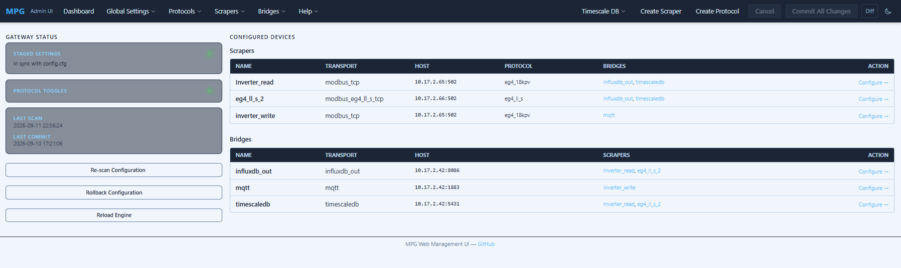
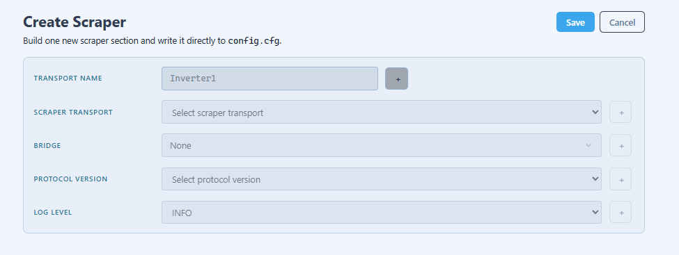

# Multi Protocol Gateway

**Multi Protocol Gateway (MPG)** reads live data from solar inverters, battery management systems (BMS), energy meters, and other Modbus/CAN-speaking hardware. MPG then fans that data out to your choice of bridges: MQTT, InfluxDB, TimescaleDB, Prometheus, and JSON — all managed through a built-in web UI; no config-file editing required. MPG allows you to read data from concurrent hardware devices and protocols, and then push the data to one, or more software bridges. If you have a device that speaks Modbus RTU/TCP, CAN bus, or one of the supported proprietary serial protocols and you want its data in Home Assistant, Grafana, Prometheus, or a time-series database, this app should work for you.

[](https://github.com/BuxtonCalvin/MultiProtocolGateway/actions/workflows/python-3.10.yml) ➔ [](https://github.com/BuxtonCalvin/MultiProtocolGateway/actions/workflows/python-3.14.yml) [! [](https://github.com) [](https://github.com/charliermarsh/ruff) [](https://github.com/BuxtonCalvin/MultiProtocolGateway/actions/workflows/codeql.yml)

[](classes/WebServer/static/screenshots/dashboard.png)

---

## Quick Start

**Recommended:** install via Docker Compose — it brings up MPG alongside whichever bridges (MQTT, InfluxDB, TimescaleDB, Grafana, etc.) you actually want. See [Full Docker Compose Stack](#full-docker-compose-stack) for the complete stack, or the minimal single-container version below.

``` ini
docker pull buxtoncalvin/multiprotocolgateway
docker run \
  -v $(pwd)/config.cfg:/app/config/config.cfg \
  -p 1717:1717 \
  buxtoncalvin/multiprotocolgateway
```

Then open **`http://localhost:1717`** and configure everything from the web UI — no manual file editing needed.

### Try It With or Without Hardware

**Prerequisites:** Python 3.10+, and (for real hardware) a device connected via USB serial adapter, RS-485 adapter, or network.

[](documentation/assets/waveshare_mpg_eg4.png)

MPG includes simulators so you can evaluate the full scrape → decode → bridge pipeline before you have a device wired up:

- `tools/modbus_server_sim.py` — a simulated Modbus TCP server MPG can scrape from
- `tools/canbus_server_sim.py` — a virtual CAN bus (`vcan0`) for CAN-based protocols

Point a `modbus_tcp` scraper at the simulator's address/port instead of real hardware, and everything else — the web UI, bridges, Grafana dashboards — works exactly as it would against a physical device.

### Installing From Source (No Docker)

``` ini
git clone https://github.com/BuxtonCalvin/MultiProtocolGateway.git
cd MultiProtocolGateway
pip install -r requirements.txt
cp config.example.cfg config.cfg   # optional — or skip and configure entirely from the web UI
python3 -u protocol_gateway.py
# or the short alias: python3 mpg.py
```

The web UI is available at **`http://localhost:1717`** as soon as the gateway starts.

[Docker Hub Repository](https://hub.docker.com/r/buxtoncalvin/multiprotocolgateway)

---

## Table of Contents

- [Feature Overview](#feature-overview)
- [Web Administration UI](#web-administration-ui)
- [Supported Protocols & Hardware Devices](#supported-protocols--hardware-devices)
- [Community Help Wanted: Stub Protocols](#community-help-wanted-stub-protocols)
- [Transport Architecture](#transport-architecture)
- [Full Docker Compose Stack](#full-docker-compose-stack)
- [Installation as a System Service](#installation-as-a-system-service)
- [Home Assistant Integration](#home-assistant-integration)
- [Grafana Sample](#grafana-sample)
- [Protocol Maps & Register Configuration](#protocol-maps--register-configuration)
- [Variable Filtering](#variable-filtering)
- [Configuration Reference](#configuration-reference)
- [Additional Tools](#additional-tools)
- [Contributing, Credits & Donations](#contributing-credits--donations)

---

## Feature Overview

| Capability                      | Details                                                                                                 |
| ------------------------------- | ------------------------------------------------------------------------------------------------------- |
| **Input protocols** (scrapers)  | Modbus RTU, Modbus TCP, Modbus TLS, Modbus UDP, CAN bus, PACE BMS serial, Pylon serial, EG4 LL-S RS-485 |
| **Output transports** (bridges) | MQTT, Timescale DB (PostgreSQL hypertable), InfluxDB, InfluxDB3, Prometheus, JSON file                  |
| **Web UI**                      | Full browser-based configuration and live management on port **1717**                                   |
| **Protocol library**            | 29 manufacturers with tested register maps; 74 more with device metadata stubbed in                     |
| **Config management**           | SQLite staging database; changes are previewed and committed — no raw file editing required.            |
| **Python versions**             | 3.10 – 3.14                                                                                             |
| **Deployment**                  | Script, systemd service, Docker container, Home Assistant add-on                                        |

---

## Web Administration UI

MPG ships with a **FastAPI + Jinja2 web server** on port **1717**. The server is not a simple settings editor — it is the primary interface for managing the entire gateway lifecycle.

[WebUI Architecture](documentation/architecture/mermaid-diagrams.md#sequence-diagram--web-ui-configuration-commit)

### Dashboard — Device Overview

The index page lists every configured **scraper** (input device) and **bridge** (output transport) in a single panel. Each entry shows its transport class, connection host/port, and real-time connection status. From here you can navigate directly into any device's settings or protocol editor.

### Scraper Settings Pane

On the left side of the page, each created device (scraper) gets a dedicated settings pane with a four-column table:

- **(A)ctive** — toggle a checkbox setting in or out of the generated `config.cfg`
- **Key** — the setting key name.
- **Value** — the value that will be written on the next commit; highlighted amber when it differs from the on-disk value
- **Default** — the fallback value from the transport module, shown for reference

[](classes/WebServer/static/screenshots/device__scraper_read_generic.png)

Changes are submitted via HTMX PATCH calls and buffered in a SQLite staging database. Nothing touches `config.cfg` until you explicitly commit.

There is an integrated help screen for each key listed in the left hand pane. Click on the default value to show help for that key.

[](classes/WebServer/static/screenshots/device__device_help.png)

### Config Safety: Backups, Rollback & Auto-Reload

Every commit to `config.cfg` is automatically versioned. If a change causes a problem, you can roll back to any previous version from the web UI without hand-editing anything.

A file watcher also monitors `config.cfg` and the `protocols/` directory for changes made outside the web UI (e.g. editing files directly over SSH). When it detects a change, MPG automatically rescans and reloads — the dashboard shows a live reload-status banner while this happens, so you always know the running configuration matches what's on disk.

See the [Staging / Commit Workflow diagram](documentation/architecture/mermaid-diagrams.md#7-state-diagram--staging--commit-workflow-web-ui) for the full state machine, including the rollback and file-watcher-resync paths.

### Create Scraper

The Create Scraper wizard walks you through creating a scraper device from scratch.

[](classes/WebServer/static/screenshots/create_scraper.png)

New to MPG? [**Analyze.md**](documentation/usage/Analyze.md) is a beginner-friendly, start-to-finish walkthrough of Create Protocol → Create Scraper → Analyze, written for readers with no prior MPG experience. For the technical step-by-step of what happens under the hood when you save a new device (including the config.cfg write and the reload-on-restart behavior), see the [Device Creation Wizard diagram](documentation/architecture/mermaid-diagrams.md#17-flowchart--device-creation-wizard).

### Protocol Editor

The protocol editor provides a full in-browser spreadsheet-style view of the register map CSV for any protocol. You can:

- Add, edit, or remove register rows inline
- Switch between the **input** (read) and **holding** (read/write) register maps
- View a real-time diff of staged versus on-disk rows before committing
- Manage orphaned rows (registers present in the DB but no longer in the CSV)
- Import and export register maps as CSV or JSON

[](classes/WebServer/static/screenshots/protocol_edit.png)

You can also edit the protocol json file. This file provides default configurations (which can be over-ridden in the config.cfg) and code lookup descriptions which will then populate your output data.

[](classes/WebServer/static/screenshots/protocol_json.png)

All edits go through a structured diff engine — the UI shows exactly which rows will be added, modified, or removed before anything is written.

### Create Protocol

The create protocol wizard walks you through creating a hardware protocol from scratch.

[](classes/WebServer/static/screenshots/create_protocol.png)

This is typically the first step for undocumented hardware — see [Analyze.md](documentation/usage/Analyze.md) for the full walkthrough, and the [Protocol Map Directory Structure diagram](documentation/architecture/mermaid-diagrams.md#16-mindmap--protocol-map-directory-structure) for how the resulting JSON descriptor and register-map CSVs are laid out on disk.

### Live Device Analysis

The **Analyze** page is the tool for working with new or undocumented hardware — including any of the 74 [stub protocols](#community-help-wanted-stub-protocols) that don't have a register map yet. For a plain-language, no-prior-experience walkthrough of this whole workflow, see [**Analyze.md**](documentation/usage/Analyze.md).

Select a physical device from the scraper page. Then in the analysis page, select one or more reference protocol maps, then click **Run Analysis**. MPG then:

1. Runs a quick probe against all four register categories (Input, Holding, Coil, Discrete), sampling a handful of addresses spread across the full address space to determine which categories the device actually responds to — this works even for a brand-new protocol that's nothing but an empty JSON stub, and doesn't depend on which "Send Holding/Input/Coil/Discrete" boxes were checked when the device was created
2. Performs a full live Modbus scan of every category that probed as supported
3. Compares the live scan against every selected protocol map
4. Scores each protocol map by accuracy — how many documented registers actually appear in the scan within value ranges set in the protocol
5. Produces per-protocol **Add** and **Remove** action lists, flagging registers that are present in the scan but absent from the default protocol map (candidates to add) and registers in the map that were not found on the device (candidates to remove)

[](classes/WebServer/static/screenshots/analysis.png)

If a category shows no response during the probe, it's reported to you as skipped (with a reason) rather than silently ignored — a **Scan Checked Anyway** control lets you force a full scan of any skipped category if you believe the probe missed it.

Each suggested change can be individually toggled into or out of the commit queue. When you click **Commit**, MPG writes only the selected changes back to the protocol CSV files and rescans the web database — no manual CSV editing required. If the device's protocol has no register map yet at all — the stub case — committing an **Add** action creates the register-map CSV from scratch using the standard column layout, so building out a brand-new protocol from a live scan works the same way as refining an existing one.

Analysis results stream back to the browser in real time via **Server-Sent Events (SSE)**, so you see scan progress line by line as registers are polled.

For the full technical breakdown of this workflow — the probe algorithm, the SSE progress plumbing, and exactly what gets written on commit — see the [Live Protocol Analysis Workflow diagram](documentation/architecture/mermaid-diagrams.md#12-flowchart--live-protocol-analysis-workflow).

### Global & Logging Settings

Separate pages manage gateway-wide settings: Read mode and dynamic configuration enable, logging configuration (log level per transport, log rotation), messages. These top level pages write through the same staging/commit pipeline as device settings.

[](classes/WebServer/static/screenshots/general_settings.png)

[](classes/WebServer/static/screenshots/logging-settings.png)

[](classes/WebServer/static/screenshots/messages.png)

### Log Viewer

A dedicated page streams the live gateway log to the browser, making it easy to watch register reads, MQTT publishes, and error traces without SSH access.

[](classes/WebServer/static/screenshots/view_log.png)

### Transport Library

A reference page listing all available transport classes — scraper types (Modbus variants, CAN bus, serial) and bridge types (MQTT, TimescaleDB, InfluxDB, InfluxDB3, Prometheus, JSON) — with their configurable parameters.

[](classes/WebServer/static/screenshots/transport_library.png)

### Settings

A reference page listing all available settings with their definitions. You can also access these descriptions from the Scraper and Bridge pages by clicking on the default value, located in the panel on the left side of the screen.

[](classes/WebServer/static/screenshots/transport_settings_trunc.png)

### Bridges

Bridges receive data from scrapers and write it somewhere. They are passive — they do not poll.

[](classes/WebServer/static/screenshots/device__bridge_timescaledb.png)

Here are overviews of two database bridges:

- InfluxDB 1.X and 3.x versions [](https://influxdata.com)

  - Advanced Features [influxdb advanced features](documentation/bridges/InfluxDB/influxdb_advanced_features.md)
  - Troubleshooting [troubleshooting influxdb](documentation/bridges/InfluxDB/troubleshooting_influxdb.md)
  - InfluxDB3 Special setup [influxDB3](documentation/bridges/InfluxDB/InfluxDB3.md)

- TimeScale DB [](https://timescale.com)

  - Readme [`Timescale DB`](documentation/bridges/TimeScaleDB/timescaledb.md)
  - Mermaid schema [Timescale DB Architecture](documentation/architecture/mermaid-diagrams.md#timescaledb-telemetry-schema-created-by-timescaledb-bridge)

Here are the overviews of the MQTT, Prometheus and JSON bridges:

- MQTT [](https://mosquitto.org) — Readme: [`MQTT`](documentation/bridges/MQTT/MQTT_bridge.md)
- Prometheus [](https://prometheus.io/) — Readme: [`Prometheus`](documentation/bridges/prometheus/prometheus.md)
- JSON — Readme: [`JSON`](documentation/bridges/JSON/json_out_example.md)

---

## Supported Protocols & Hardware Devices

MPG ships with pre-built, tested protocol maps for the following manufacturers. Each protocol map is a range of CSV files (typically input and holding register maps but can also be coil or discrete register maps) plus a JSON descriptor:

| Manufacturer | Models / Protocols | Link |
| --- | --- | --- |
| **APsystems** | APsystems ECU SunSpec gateway (`apsystems_ecu_sunspec` via Modbus ) | **[`View APsystems`](documentation/devices/APsystems.md)** |
| **Deye Sunsynk** | Hybrid Inverters (`deye_sunsynk` via Modbus), Extended Map (`deye_sunsynk_hybrid` via Modbus) | **[`View Deye Sunsynk`](documentation/devices/Deye_Sunsynk.md)** |
| **EG4** | 18KPV Inverter (`eg4_18kpv` via Modbus), 3000EHV Inverter (`eg4_3000ehv_v1` via Modbus ), GridBOSS / Related Equipment (`eg4_gridboss_re` via Modbus ), LL-S Battery (`eg4_ll_s` via Modbus ), 6000XP / 12000XP / 18KPV Family (`eg4_v58` via Modbus) | **[`View EG4`](documentation/devices/EG4.md)** |
| **Enphase** | Enphase IQ Gateway SunSpec (`enphase_iq_gateway_sunspec` via Modbus) | **[`View Enphase`](documentation/devices/Enphase.md)** |
| **FoxESS** | H1 LAN / KH / H3-style holding-register map (`foxess_h1_lan` via Modbus ) | **[`View FoxESS`](documentation/devices/FoxESS.md)** |
| **Fronius** | Fronius SunSpec Inverters (`fronius_sunspec` via Modbus) | **[`View Fronius`](documentation/devices/Fronius.md)** |
| **GoodWe** | Energy Storage / Hybrid Inverters (`goodwe_energy_storage` via Modbus ) — *partial map, verify against your firmware version* | **[`View GoodWe`](documentation/devices/GoodWe.md)** |
| **Growatt** | Inverter Protocol v1.24 (`growatt_2020_v1.24` via Modbus ), BMS CAN Bus v1.04 (`growatt_bms_canbus_v1.04` via CAN bus), BMS RS-485 1xSxxP ESS v2.01 (`growatt_bms_rs485_1xsxxp_ess_v2.01` via Modbus ), SPF / Off-Grid Protocol v0.14 (`growatt_v0.14` via Modbus ) | **[`View Growatt`](documentation/devices/Growatt.md)** |
| **HDHK** | 16-channel AC Power Monitor (`hdhk_16ch_ac_module` via Modbus ) | **[`View HDHK`](documentation/devices/HDHK.md)** |
| **Huawei** | Huawei SUN2000 Inverters (`huawei_sun2000` via Modbus ) | **[`View Huawei`](documentation/devices/Huawei.md)** |
| **LuxPower** | 12K Hybrid Inverter (`lxp_12k_hybrid` via Modbus ) | *No dedicated guide yet but should be the same as EG4— [open an issue](https://github.com/BuxtonCalvin/MultiProtocolGateway/issues) if you'd like to write one* |
| **Next Power** | Next Power Victor NM RE (`next_power_victor_nm_re` via Modbus ) | **[`View Next Power`](documentation/devices/Next_Power.md)** |
| **PACE BMS** | PACE BMS RS-485 v1.3 (`pace_bms_v1.3` via Modbus ) | **[`View PACE BMS`](documentation/devices/PACE.md)** |
| **PowMr** | Off-Grid / Hybrid Inverter (`powmr` via Modbus ) | *No dedicated guide yet — [open an issue](https://github.com/BuxtonCalvin/MultiProtocolGateway/issues) if you'd like to write one* |
| **Pylon** | CAN Bus (`pylon_can` via CAN bus), RS-485 v3.3 (`pylon_rs485_v3.3` via Pylon serial) | **[`View Pylon`](documentation/devices/Pylon.md)** |
| **Sigenergy** | SigenStor Plant Data (`sigenergy_plant` via Modbus ), Sigen Hybrid / SigenStor EC Device Data (`sigenergy_hybrid` via Modbus ) | **[`View Sigenergy`](documentation/devices/Sigenergy.md)** |
| **Sigineer** | Solar Inverter / Charger v0.11 (`sigineer_v0.11` via Modbus ) | **[`View Sigineer`](documentation/devices/Sigineer.md)** |
| **SMA** | Energy Meter Speedwire (`sma_energy_meter_speedwire` via Modbus ), CAN / Modbus RTU Map (`sma_modbus_rtu` via CAN bus), Sunny Home Manager (`sma_sunny_home_manager` via Modbus ), Sunny Island (`sma_sunny_island` via Modbus ), Sunny Island v1 (`sma_sunny_island_v1` via Modbus ), Sunny Boy / Tripower (`sma_sunnyboy_tripower` via Modbus ), Tripower Storage Hybrid (`sma_tripower_storage_hybrid` via Modbus ) | **[`View SMA`](documentation/devices/SMA.md)** |
| **SOK** | SOK SK48V100 / PACE BMS (`sok_sk48v100_pace_bms` via Modbus ) | **[`View SOK`](documentation/devices/SOK.md)** |
| **Solar Edge** | SolarEdge SunSpec Inverters (`solaredge_sunspec` via Modbus) | **[`View Solar Edge`](documentation/devices/SolarEdge.md)** |
| **SolaX** | X1/X3 Hybrid G4-style Inverters (`solax_hybrid_g4` via Modbus ) | **[`View SolaX`](documentation/devices/SolaX.md)** |
| **SolArk** | Hybrid Inverter (`solark_hybrid` via Modbus ), Modbus v1.1 (`solark_v1.1` via Modbus ) | **[`View SolArk`](documentation/devices/SolArk.md)** |
| **Solinteg** | INTEG MHT 25–50K Hybrid (`solinteg_integ_mht_25_50_k` via Modbus ) — *partial map from public Modbus PDF* | **[`View Solinteg`](documentation/devices/Solinteg.md)** |
| **Solis** | Hybrid Inverters (`solis_hybrid` via Modbus ), String Inverters (`solis_string` via Modbus ) | **[`View Solis`](documentation/devices/Solis.md)** |
| **SRNE** | Energy-Storage Inverter v1.96 (`srne_2021_v1.96` via Modbus ), Energy-Storage Inverter v1.7 (`srne_v1.7` via Modbus ), Controller / Inverter v3.9 (`srne_v3.9` via Modbus ) | **[`View SRNE`](documentation/devices/SRNE.md)** |
| **Sungrow** | SH / RS / RT Hybrid Inverters (`sungrow_hybrid` via Modbus ), SG-series String Inverters (`sungrow_sg` via Modbus ) | **[`View Sungrow`](documentation/devices/Sungrow.md)** |
| **Sunmart** | Off-Grid Inverter (`sunmart` via Modbus ) | *No dedicated guide yet — [open an issue](https://github.com/BuxtonCalvin/MultiProtocolGateway/issues) if you'd like to write one* |
| **Victron** | BMV Battery Monitor (`victron_bmv_battery_monitor` via Modbus ), GX Generic CAN Bus (`victron_gx_generic_canbus` via CAN bus), GX v3.3 (`victron_gx_v3.3` via Modbus ), MK3-USB VE.Bus (`victron_mk3usb_vebus` via Modbus ), MultiPlus / Quattro (`victron_multiplus_quattro` via Modbus ), Phoenix Inverter (`victron_phoenix_inverter` via Modbus ), SmartSolar MPPT (`victron_smartsolar_mppt` via Modbus ), VE.Direct Serial Devices (`victron_vedirect_serial` via VE.Direct serial), Venus GX System (`victron_venus_gx_system` via Modbus ) | **[`View Victron`](documentation/devices/Victron.md)** |
| **Voltronic** | BMS 2020-03-25 (`voltronic_bms_2020_03_25` via Modbus ), BMS v1.1 (`voltronic_bms_v1.1` via Modbus ) | **[`View Voltronic`](documentation/devices/Voltronic.md)** |

Battery packs that speak an existing protocol are also covered even without their own folder — e.g. **AOLithium** 48V server-rack batteries work over the Voltronic RS485, Victron GX CAN, or SMA Sunny Island CAN maps depending on DIP-switch mode; see **[`View AOLithium`](documentation/devices/AOLithium.md)**.

For a full list of tested devices and community-reported compatibility, see [`devices_and_protocols.csv`](documentation/usage/devices_and_protocols.csv).

MPG also supports any generic Modbus RTU or TCP device when given a register map: the [Live Analysis tool](#live-device-analysis) is specifically designed to help build maps for undocumented hardware.

---

## Community Help Wanted: Stub Protocols

Beyond the 29 manufacturers above, MPG has device metadata already stubbed in for **74 more manufacturers** — a JSON descriptor with the transport type and default settings, but no register map yet. These exist because someone requested or started the device but a full map hasn't been built. If you own one of these and can run the [Live Analysis tool](#live-device-analysis) against it, you can generate and commit a working register map directly from the web UI — no CSV editing required, and no need to already know the register layout. New to MPG? [**Analyze.md**](documentation/usage/Analyze.md) walks through this exact scenario (Create Protocol → Create Scraper → Analyze) start to finish for readers with no prior experience.

A few of these already have a wiring/protocol reference guide to jump-start the work, even though the register map itself is still pending: **[Kostal](documentation/devices/Kostal.md)**, **[KSTAR](documentation/devices/KSTAR.md)**, and **[Sofar](documentation/devices/Sofar.md)**.

### Full list of stub-protocol manufacturers

A-Tronix, ABB, ABB Fimer, Accuenergy, Acrel, Afore, Algodue, AlphaESS, Ampowr, Anexo, Angile, Autarco, Autel, BMR, Cadis, Carlo Gavazzi, Chint, Chisage, Danfoss, Delta, Diehl AKO, Dornscheidt, Dyness, Dysun, Eastron, Enbrilion, Energreen, Enerlution, Enjoypowers, ESY, Fairland, Fortona, Gotion, Hager, Hypontech, Hyxipower, Inepro, Itho Daalderop, Janitza, Kehua, Kostal, KSTAR, Legrand, LitiOT, Marstek, Mastervolt, Mennekes, Metcom, Midteq, Motoma, Nibe, Pilot, Power-Sonic, Raedian, Regitec, Remeha, Renon, Ritar, SAV, Schneider, Schüco, Siemens, Sinexcel, Socomec, Sofar, Solarmax, SolarWatt, Solplanet, Sunwaytech, Sunwoda, Teltonika, Vacon, Weidmüller, Zetara

If you'd rather contribute a hand-built map, protocol CSVs use a standardized column set (`register`, `variable_name`, `documented_name`, `unit`, `data_type`, `values`, `read_interval`, `writable`, `adjustments`, `note`) — see [Protocol Maps & Register Configuration](#protocol-maps--register-configuration) for the full reference. Pull requests adding a register map, wiring notes, or corrections for any of these are welcome.

---

## Transport Architecture

MPG separates **scrapers** (devices it reads from) and **bridges** (destinations it writes to). A single gateway instance can run multiple scrapers and multiple bridges simultaneously.

``` ini
Hardware Device
      │  (Modbus RTU / TCP / TLS / UDP / CAN / Serial)
      ▼
 ┌─────────────┐
 │  Scraper    │  modbus_tcp · modbus_rtu · modbus_tls · modbus_udp · canbus · pace · pylon · eg4_ll_s
 └──────┬──────┘
        │  parsed register values
        ▼
 ┌─────────────┐
 │   Bridge    │  mqtt · timescaledb · influxdb_out · influxdb3_out · prometheus_out · json_out
 └─────────────┘
```

Each transport is independently configurable with its own scan interval, log level, variable mask, and protocol version. A scraper and bridge sharing the same `device_name` are linked — the scraper reads data, the bridge publishes it.

[Complete Transport Architecture](documentation/architecture/mermaid-diagrams.md#2-sequence-diagram--scrape-cycle--bridge-output) · [Connection Lifecycle & Alerting](documentation/architecture/mermaid-diagrams.md#6-state-diagram--transport-connection-lifecycle)

**Transport** — `read_registers()`: one Modbus transaction, block of registers or a single register.

**Bus Logic** — `read_modbus_registers()`: retries, delays, batching, locking, disabled ranges.

**Scheduler** — `read_data_iter()`, `read_data()`, `read_group_data()`: interleaving across devices per device response, or concurrently for similar, robust scrapers, or read sequentially.

**Protocol Decoding** — `process_registery()` → derived values → publish to bridges.

---

## Full Docker Compose Stack

For a complete monitoring stack — MPG + Timescale DB + InfluxDB + InfluxDB3 + MQTT + Prometheus + pgAdmin + Chronograf + Grafana — see the included [`docker-compose.yml`](documentation/docker/docker-compose.yml) in this repository, or the [Deployment / Container diagram](documentation/architecture/mermaid-diagrams.md#14-deployment--container-diagram--docker-stack) for the full topology, ports, and data paths.

The stack provides:

| Service                | Port        | Purpose                                              |
| ---------------------- | ----------- | ---------------------------------------------------- |
| **MPG**                | 1717        | Gateway web UI and core service                      |
| **Timescale DB**       | 5432        | Time-series PostgreSQL for long-term storage         |
| **InfluxDB**           | 8086        | Alternative time-series database                     |
| **InfluxDB3**          | 8181        | Alternative time-series database                     |
| **influxdb3-explorer** | 8888        | Influx3 administration                               |
| **Mosquitto MQTT**     | 1883 / 9001 | MQTT broker for Home Assistant and other subscribers |
| **Prometheus**         | 9090        | Prometheus metrics                                   |
| **pgAdmin**            | 5050        | PostgreSQL/Timescale DB web management UI            |
| **Chronograf**         | 8888        | InfluxDB web dashboard                               |
| **Grafana**            | 3000        | Unified visualization for all data sources           |
| **Portainer**          | 9000        | Portainer Docker management                          |

Remove any services you don't want from the compose file. Make sure to also install the accompanying `.env`, `mosquitto.conf`, and `MPG.yaml` (Grafana provisioning) files. On first run, the Docker script copies a basic `config.cfg` into your config folder — from there, use the web UI to customize it.

Start the full stack:

``` ini
cp .env.example .env
# Edit .env to set passwords and data paths
docker compose up -d
```

---

## Installation as a System Service

MPG can run as a systemd service that starts automatically on boot.

``` ini
cp protocol_gateway.example.service /etc/systemd/system/protocol_gateway.service
nano /etc/systemd/system/protocol_gateway.service   # set WorkingDirectory to your install path

sudo systemctl daemon-reload
sudo systemctl enable protocol_gateway.service
sudo systemctl start protocol_gateway.service
systemctl status protocol_gateway.service
```

The short alias `mpg` can be used as the service name if preferred, matching the `mpg.py` entry-point script.

---

## Home Assistant Integration

MPG publishes data to MQTT using Home Assistant's auto-discovery format. Devices appear automatically under **Settings → Devices & Services → MQTT** once the broker is configured on both sides.

### Install Mosquitto on Home Assistant (if not installed via docker)

``` ini
Settings → Add-Ons → Add-On Store → Mosquitto broker
```

Create an MQTT user:

``` ini
Settings → People → Users → Add User → Can only log in from the local network
```

For connecting an external MQTT broker to Home Assistant, see [this guide](https://www.youtube.com/watch?v=sP2gYLYQat8).

### Troubleshooting: Unknown Status

If all MQTT values appear as "Unknown" immediately after setup, this is a known Home Assistant discovery timing issue. Restart the MPG service and the values will populate correctly.

---

## Grafana Sample

Data produced by any of the MPG bridges can be visualized in Grafana. This example is using the influxdb bridge.

[](documentation/assets/GrafanaSolar.png)

The code for this InfluxDB dashboard: [Grafana InfluxDB JSON](documentation/dashboards/GrafanaInfluxDBDashboard.json)

The code for the same InfluxDB3 dashboard can be found here: [Grafana InfluxDB3 JSON](documentation/dashboards/GrafanaInfluxDB3Dashboard.json)

The code for the exact same style TimescaleDB dashboards:

- [Grafana TimescaleDB Wide Table JSON](documentation/dashboards/GrafanaTimescaleDBWideDashboard.json)
- [Grafana TimescaleDB Narrow Table JSON](documentation/dashboards/GrafanaTimescaleDBNarrowDashboard.json)

---

## Protocol Maps & Register Configuration

Each supported device has a protocol directory under `protocols/` containing:

- **`<name>.json`** — device metadata: transport type, default settings, lookup descriptions for codes
- **`<name>.holding_registry_map.csv`** — read/write (holding) Modbus registers

  **additional optional registers**  - per manufacturer device properties
  - **`<name>.input_registry_map.csv`** — read-only (input) Modbus registers
  - **`<name>.coil_registry_map.csv`** — read/write (coil) Modbus registers
  - **`<name>.discrete_registry_map.csv`** — read-only (discrete) Modbus registers

The CSV files use `,` as delimiter (OpenOffice/LibreOffice compatible) and support the following columns — this column set is standardized across every protocol map in the repo, hand-built or generated:

| Column            | Description                                           |
| ----------------- | ----------------------------------------------------- |
| `register`        | Modbus register number                                |
| `variable_name`   | Friendly name used in MQTT topics and DB columns      |
| `documented_name` | Original name from the device manual                  |
| `data_type`       | e.g. `int16`, `uint16`, `float32`, `bit`              |
| `unit`            | e.g. `V`, `A`, `W`, `°C`, 1 , .01 , 10 etc.           |
| `values`          | Valid range or enumeration                            |
| `read_interval`   | Override the global poll interval for this register   |
| `writable`        | `R` (read-only) or `RW` (writable)                    |
| `adjustments`     | JSON encoded code to enable special register handling |
| `note`            | Free-form note shown in the web UI                    |

Variable names have been normalized for readability. To use original documented names, clear the `variable_name` column in the CSV or edit via the Protocol Editor in the web UI.

Find more protocol documentation here: [protocols](documentation/usage/protocols.md)

### Using the Live Analysis Tool to Build New Maps

Because the column layout above is fixed, building a map for a new or stub protocol only requires deciding *which register type* you're populating (holding, input, coil, or discrete) — and that's determined for you by where each register actually responds during the scan:

1. Connect your device and confirm it appears in the MPG dashboard
2. Navigate to **Analyze → [Device Name]**
3. Select one or more reference protocol maps to compare against (or none, if the device's own protocol is a stub with nothing to compare)
4. Click **Run Analysis** and wait for the scan to complete
5. Review the scored results — higher accuracy means a closer protocol match; a stub protocol with no existing map will show every live register as an **Add** candidate
6. Toggle individual register additions and removals into the commit queue
7. Click **Commit** — MPG writes the changes to the protocol CSV files, creating the file first if the protocol didn't have one yet

---

## Variable Filtering

### Allowlist (`variable_mask_{transport_name}.txt`)

To publish only a specific set of variables, list them one per line. An empty file means all variables are published.
Each scraper has its own mask file.

``` ini
battery_voltage
battery_soc
grid_power
```

### Blocklist (`variable_screen_{transport_name}.txt`)

To exclude specific variables from all outputs:
Each scraper has its own screen file.

``` ini
internal_temperature_raw
debug_register_42
```

### Register Failure Tracking

The register failure tracking system automatically detects and soft-disables problematic register ranges that consistently fail to read. This helps improve system reliability by avoiding repeated attempts to read from registers that are known to be problematic.

Find more register failure documentation here: [register failure tracking](documentation/usage/register_failure_tracking.md) · [state diagram](documentation/architecture/mermaid-diagrams.md#15-state-diagram--register-failure-tracker)

Register failures appear as red high-lit rows in the transport scraper window.

---

## Configuration Reference

The primary configuration is `config.cfg` (INI format). Each `[section]` represents one transport instance. The web UI manages this file — direct editing is supported but the UI's staging/commit workflow is recommended to avoid syntax errors.

Key settings available on every transport:

| Key                | Default | Description                                                |
| ------------------ | ------- | ---------------------------------------------------------- |
| `device_name`      |         | Unique identifier linking scraper and bridge               |
| `protocol_version` |         | Protocol map to load (e.g. `growatt_v0.14`)                |
| `batch_size`       | `40`    | Number of registers to batch read per a given scraper poll |
| `read_interval`    | `15`    | Seconds between register polls                             |
| `bridge`           |         | Output transport section name or names                     |
| `log_level`        | `INFO`  | Per-transport log verbosity                                |
| `max_precision`    | `2`     | Decimal places for float values                            |
| `write_enabled`    | `false` | Enable Modbus write operations                             |
| `variable_mask`    |         | Path to allowlist file                                     |
| `variable_screen`  |         | Path to blocklist file                                     |

For Modbus transports, additional keys include `host`, `port`, `unit_id`, `max_retries_per_block`, and `disable_duration_hours`.

Full configuration documentation: [transports](documentation/usage/transports.md)

For manufacturer device-specific wiring and installation guides: [devices](documentation/devices)

---

## Additional Tools

Beyond the core gateway, `tools/` includes a few standalone utilities:

- **`modbus_server_sim.py`** / **`canbus_server_sim.py`** — simulate a Modbus TCP server or virtual CAN bus for testing MPG without physical hardware (see [Try It Without Hardware](#try-it-with-or-without-hardware))
- **`InfluxDateConverter.py`** — export, repair, and re-import InfluxDB time-series data, including importing EG4 inverter CSV exports and shifting timestamps into a new range; see [Influx Date Converter](tools/ReadmeInfluxDateConverter.md) for the full guide

---

## Contributing, Credits & Donations

MPG was built because no working open-source solution existed that could poll disparate devices at the same time, and then send that disparate data to disparate outputs. Community protocol maps (including for any of the [stub protocols](#community-help-wanted-stub-protocols) above), bug reports, and pull requests are welcome.

This application was inspired by and built upon the excellent work by [@HotNoob](https://github.com/HotNoob/PythonProtocolGateway) and their PythonProtocolGateway project, and its precedent project by [@andiburger](https://github.com/andiburger/growatt2mqtt). We extend our sincere gratitude for their efforts in solar inverter data management. MPG diverges from these efforts with Web UI management, concurrent multi-protocol capability, multiple concurrent bridges, extended hardware device support including coils and discrete registers, and completely re-factored data read/write logic that hardens checks against bad data.

If MPG has saved you time or money, donations and GitHub sponsorships are appreciated and help fund continued development.

[GitHub Sponsors](https://github.com/sponsors/BuxtonCalvin)
