# MultiProtocolGateway — Architecture Diagrams

Mermaid diagrams for the Multi Protocol Gateway (MPG) data bridge. MPG reads solar/energy hardware over Modbus, CAN, and serial protocols, decodes register maps, and forwards telemetry to MQTT, TimescaleDB, InfluxDB, and JSON outputs. Configuration is managed through a FastAPI web UI on port 1717.

---

## 1. Flowchart — System Data & Configuration Flow

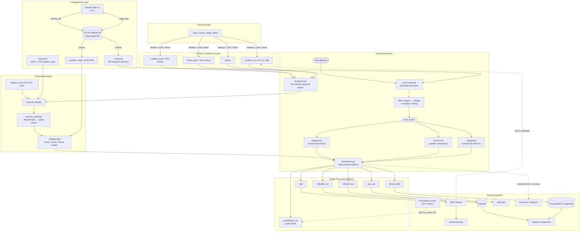
```mermaid
flowchart TD
    subgraph Hardware["Physical Layer"]
        INV["Solar Inverter / BMS / Meter"]
    end

    subgraph Config["Configuration Layer"]
        CFG["config.cfg<br/>(INI transport sections)"]
        PROTO["protocols/<br/>JSON + CSV register maps"]
        MASK["variable_mask / screen files"]
        STAGE[(SQLite Staging DB<br/>mpg_staging.db)]
        UI["FastAPI Web UI<br/>:1717"]
    end

    subgraph Gateway["Protocol_Gateway"]
        START([Start gateway])
        LOAD["Load config.cfg<br/>Instantiate transports"]
        WIRE["Wire scrapers → bridges<br/>via bridge= setting"]
        MODE{{"read_mode?"}}
        SEQ["Sequential<br/>(shared RS-485 bus)"]
        CONC["Concurrent<br/>(parallel connections)"]
        INTER["Interleaved<br/>(round-robin blocks)"]
        GROUP["ScrapeGroup<br/>one read per physical device"]
        SCHED["Scheduler loop<br/>read_interval cadence"]
    end

    subgraph Scrapers["Scraper Transports (Input)"]
        MB["modbus_rtu / tcp / tls / udp"]
        CAN["canbus"]
        SER["serial_pylon / serial_frame"]
        PACE["modbus_pace / EG4 variants"]
    end

    subgraph Decode["Protocol Decoding"]
        PS["protocol_settings"]
        REG["registry_map_entry CSV rows"]
        PROC["process_registry()<br/>decode bytes → typed values"]
        FILT["Variable filter<br/>mask / screen / failure tracker"]
    end

    subgraph Bridges["Bridge Transports (Output)"]
        MQTT["mqtt"]
        TS["timescaledb"]
        IN1["influxdb_out"]
        IN3["influxdb3_out"]
        JSON["json_out"]
        PROM["prometheus_out<br/>(pull model)"]
    end

    subgraph External["External Systems"]
        BROKER["MQTT Broker"]
        HA["Home Assistant"]
        TSDB[(TimescaleDB / PostgreSQL)]
        INFLUX[(InfluxDB)]
        JFILE["JSON file"]
        GRAF["Grafana / Node-RED"]
        ALERT["Pushover / Telegram"]
        PSCRAPE["Prometheus server<br/>GET /metrics"]
    end

    %% Config flow
    CFG --> LOAD
    PROTO --> PS
    MASK --> FILT
    UI <-->|"stage edits"| STAGE
    STAGE -->|"commit"| CFG
    STAGE -->|"commit"| MASK
    UI -->|"preview diff"| STAGE

    %% Startup
    START --> LOAD --> WIRE --> MODE
    MODE --> SEQ & CONC & INTER
    SEQ & CONC & INTER --> SCHED

    %% Data flow
    INV -->|"Modbus / CAN / Serial"| MB & CAN & SER & PACE
    MB & CAN & SER & PACE --> GROUP
    GROUP --> PS
    REG --> PS
    PS --> PROC --> FILT
    FILT --> SCHED
    SCHED --> MQTT & TS & IN1 & IN3 & JSON & PROM

    MQTT --> BROKER --> HA
    TS --> TSDB --> GRAF
    IN1 & IN3 --> INFLUX --> GRAF
    JSON --> JFILE
    PSCRAPE -.->|"pull, e.g. every 10s"| PROM

    BROKER -.->|"MQTT writeback"| MB

    SCHED -.->|"connection loss / recovery"| ALERT
```

---

## 2. Sequence Diagram — Scrape Cycle & Bridge Output

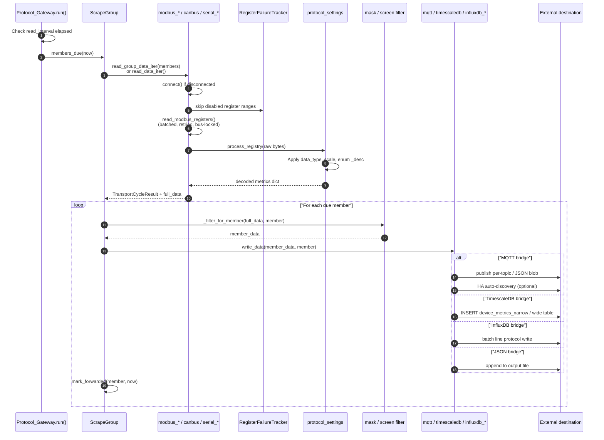
```mermaid
sequenceDiagram
    autonumber
    participant Gateway as Protocol_Gateway.run()
    participant Group as ScrapeGroup
    participant Scraper as modbus_* / canbus / serial_*
    participant Fail as RegisterFailureTracker
    participant Proto as protocol_settings
    participant Filter as mask / screen filter
    participant Bridge as mqtt / timescaledb / influxdb_*
    participant Dest as External destination

    Gateway->>Gateway: Check read_interval elapsed
    Gateway->>Group: members_due(now)
    Group->>Scraper: read_group_data_iter(members)<br/>or read_data_iter()
    Scraper->>Scraper: connect() if disconnected
    Scraper->>Fail: skip disabled register ranges
    Scraper->>Scraper: read_modbus_registers()<br/>(batched, retried, bus-locked)
    Scraper->>Proto: process_registry(raw bytes)
    Proto->>Proto: Apply data_type, scale, enum _desc
    Proto-->>Scraper: decoded metrics dict
    Scraper-->>Group: TransportCycleResult + full_data

    loop "For each due member"
        Group->>Filter: _filter_for_member(full_data, member)
        Filter-->>Group: member_data
        Group->>Bridge: write_data(member_data, member)
        
        alt "MQTT bridge"
            Bridge->>Dest: publish per-topic / JSON blob
            Bridge->>Dest: HA auto-discovery (optional)
        else "TimescaleDB bridge"
            Bridge->>Dest: INSERT device_metrics_narrow / wide table
        else "InfluxDB bridge"
            Bridge->>Dest: batch line protocol write
        else "JSON bridge"
            Bridge->>Dest: append to output file
        end
        
        Group->>Group: mark_forwarded(member, now)
    end
```

### Sequence Diagram — Web UI Configuration Commit

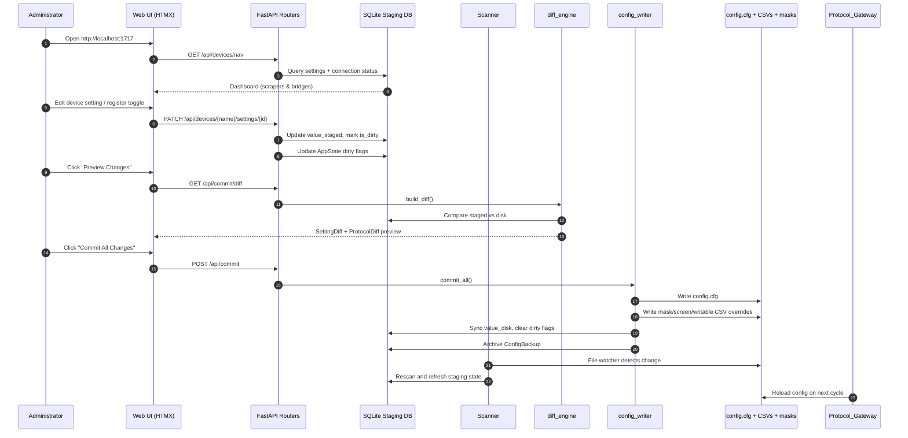
```mermaid
sequenceDiagram
    autonumber
    participant Admin as Administrator
    participant UI as Web UI (HTMX)
    participant API as FastAPI Routers
    participant DB as SQLite Staging DB
    participant Scan as Scanner
    participant Diff as diff_engine
    participant Writer as config_writer
    participant Disk as config.cfg + CSVs + masks
    participant GW as Protocol_Gateway

    Admin->>UI: Open http://localhost:1717
    UI->>API: GET /api/devices/nav
    API->>DB: Query settings + connection status
    DB-->>UI: Dashboard (scrapers & bridges)

    Admin->>UI: Edit device setting / register toggle
    UI->>API: PATCH /api/devices/{name}/settings/{id}
    API->>DB: Update value_staged, mark is_dirty
    API->>DB: Update AppState dirty flags

    Admin->>UI: Click "Preview Changes"
    UI->>API: GET /api/commit/diff
    API->>Diff: build_diff()
    Diff->>DB: Compare staged vs disk
    Diff-->>UI: SettingDiff + ProtocolDiff preview

    Admin->>UI: Click "Commit All Changes"
    UI->>API: POST /api/commit
    API->>Writer: commit_all()
    Writer->>Disk: Write config.cfg
    Writer->>Disk: Write mask/screen/writable CSV overrides
    Writer->>DB: Sync value_disk, clear dirty flags
    Writer->>DB: Archive ConfigBackup

    Scan->>Disk: File watcher detects change
    Scan->>DB: Rescan and refresh staging state
    GW->>Disk: Reload config on next cycle
```

---

## 3. Class Diagram — Core Classes & Relationships

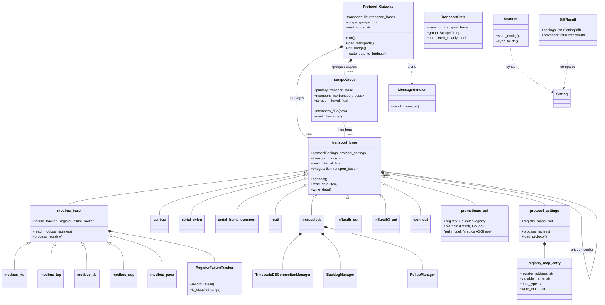
```mermaid
classDiagram
    direction TB

    class Protocol_Gateway {
        -transports: list~transport_base~
        -scrape_groups: dict
        -read_mode: str
        +run()
        +load_transports()
        +init_bridge()
        -_route_data_to_bridges()
    }

    class ScrapeGroup {
        +primary: transport_base
        +members: list~transport_base~
        +scrape_interval: float
        +members_due(now)
        +mark_forwarded()
    }

    class TransportState {
        +transport: transport_base
        +group: ScrapeGroup
        +completed_cleanly: bool
    }

    class transport_base {
        +protocolSettings: protocol_settings
        +transport_name: str
        +read_interval: float
        +bridges: list~transport_base~
        +connect()
        +read_data_iter()
        +write_data()
    }

    class modbus_base {
        +failure_tracker: RegisterFailureTracker
        +read_modbus_registers()
        +process_registry()
    }

    class RegisterFailureTracker {
        +record_failure()
        +is_disabled(range)
    }

    class modbus_rtu
    class modbus_tcp
    class modbus_tls
    class modbus_udp
    class modbus_pace
    class canbus
    class serial_pylon
    class serial_frame_transport
    class mqtt
    class timescaledb
    class influxdb_out
    class influxdb3_out
    class json_out
    class prometheus_out {
        +registry: CollectorRegistry
        +metrics: dict~str, Gauge~
        "pull model: /metrics ASGI app"
    }

    class protocol_settings {
        +registry_maps: dict
        +process_registry()
        +load_protocol()
    }

    class registry_map_entry {
        +register_address: str
        +variable_name: str
        +data_type: str
        +write_mode: str
    }

    class Scanner {
        +scan_config()
        +sync_to_db()
    }

    class DiffResult {
        +settings: list~SettingDiff~
        +protocols: list~ProtocolDiff~
    }

    class MessageHandler {
        +send_message()
    }

    Protocol_Gateway "1" *-- "many" transport_base : manages
    Protocol_Gateway "1" *-- "many" ScrapeGroup : groups scrapers
    ScrapeGroup "1" o-- "many" transport_base : members

    transport_base <|-- modbus_base
    modbus_base <|-- modbus_rtu
    modbus_base <|-- modbus_tcp
    modbus_base <|-- modbus_tls
    modbus_base <|-- modbus_udp
    modbus_base <|-- modbus_pace
    transport_base <|-- canbus
    transport_base <|-- serial_pylon
    transport_base <|-- serial_frame_transport
    transport_base <|-- mqtt
    transport_base <|-- timescaledb
    transport_base <|-- influxdb_out
    transport_base <|-- influxdb3_out
    transport_base <|-- json_out
    transport_base <|-- prometheus_out

    modbus_base *-- RegisterFailureTracker
    transport_base *-- protocol_settings
    protocol_settings *-- registry_map_entry

    transport_base "scraper" --> "bridge" transport_base : bridge= config

    timescaledb *-- TimescaleDBConnectionManager
    timescaledb *-- BacklogManager
    timescaledb *-- RollupManager

    Scanner ..> Setting : syncs
    DiffResult ..> Setting : compares
    Protocol_Gateway ..> MessageHandler : alerts
```

---

## 4. Entity Relationship (ER) Diagram

### SQLite Staging Database (`mpg_staging.db`)

Used by the Web UI to stage configuration edits before committing to disk. Not used for telemetry storage.

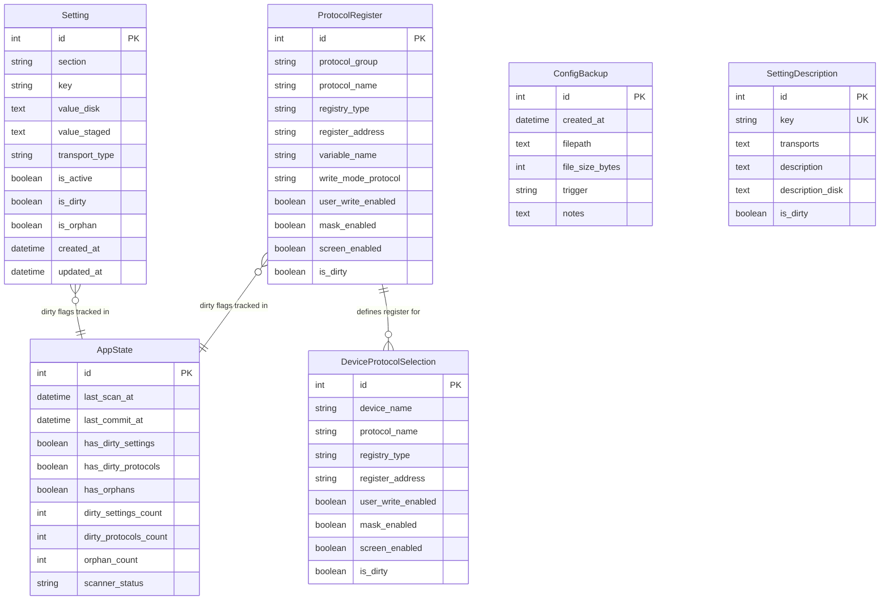
```mermaid
erDiagram
    Setting {
        int id PK
        string section
        string key
        text value_disk
        text value_staged
        string transport_type
        boolean is_active
        boolean is_dirty
        boolean is_orphan
        datetime created_at
        datetime updated_at
    }

    ProtocolRegister {
        int id PK
        string protocol_group
        string protocol_name
        string registry_type
        string register_address
        string variable_name
        string write_mode_protocol
        boolean user_write_enabled
        boolean mask_enabled
        boolean screen_enabled
        boolean is_dirty
    }

    DeviceProtocolSelection {
        int id PK
        string device_name
        string protocol_name
        string registry_type
        string register_address
        boolean user_write_enabled
        boolean mask_enabled
        boolean screen_enabled
        boolean is_dirty
    }

    ConfigBackup {
        int id PK
        datetime created_at
        text filepath
        int file_size_bytes
        string trigger
        text notes
    }

    AppState {
        int id PK
        datetime last_scan_at
        datetime last_commit_at
        boolean has_dirty_settings
        boolean has_dirty_protocols
        boolean has_orphans
        int dirty_settings_count
        int dirty_protocols_count
        int orphan_count
        string scanner_status
    }

    SettingDescription {
        int id PK
        string key UK
        text transports
        text description
        text description_disk
        boolean is_dirty
    }

    ProtocolRegister ||--o{ DeviceProtocolSelection : "defines register for"
    Setting }o--|| AppState : "dirty flags tracked in"
    ProtocolRegister }o--|| AppState : "dirty flags tracked in"
```

### TimescaleDB Telemetry Schema (created by `timescaledb` bridge)

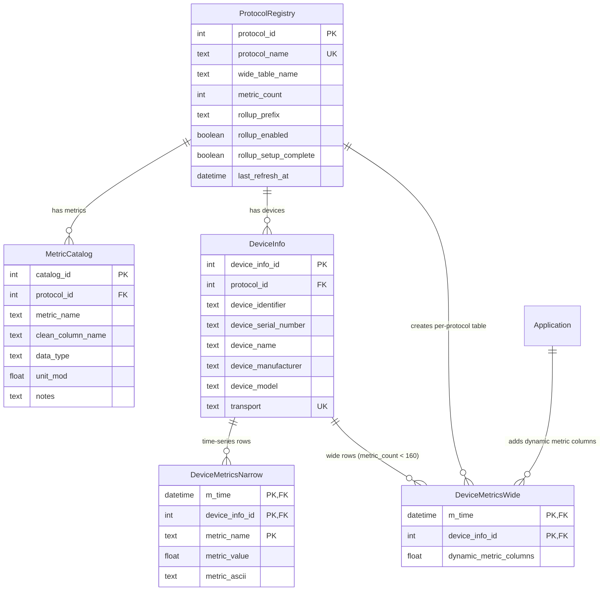
```mermaid
erDiagram
    ProtocolRegistry {
        int protocol_id PK
        text protocol_name UK
        text wide_table_name
        int metric_count
        text rollup_prefix
        boolean rollup_enabled
        boolean rollup_setup_complete
        datetime last_refresh_at
    }

    MetricCatalog {
        int catalog_id PK
        int protocol_id FK
        text metric_name
        text clean_column_name
        text data_type
        float unit_mod
        text notes
    }

    DeviceInfo {
        int device_info_id PK
        int protocol_id FK
        text device_identifier
        text device_serial_number
        text device_name
        text device_manufacturer
        text device_model
        text transport UK
    }

    DeviceMetricsNarrow {
        datetime m_time PK, FK
        int device_info_id PK, FK
        text metric_name PK
        float metric_value
        text metric_ascii
    }

    DeviceMetricsWide {
        datetime m_time PK, FK
        int device_info_id PK, FK
        float dynamic_metric_columns
    }

    ProtocolRegistry ||--o{ MetricCatalog : "has metrics"
    ProtocolRegistry ||--o{ DeviceInfo : "has devices"
    DeviceInfo ||--o{ DeviceMetricsNarrow : "time-series rows"
    DeviceInfo ||--o{ DeviceMetricsWide : "wide rows (metric_count &lt; 160)"
    ProtocolRegistry ||--o{ DeviceMetricsWide : "creates per-protocol table"
    Application ||--o{ DeviceMetricsWide : "adds dynamic metric columns"
```

---

## 5. User Journey — MPG Administrator

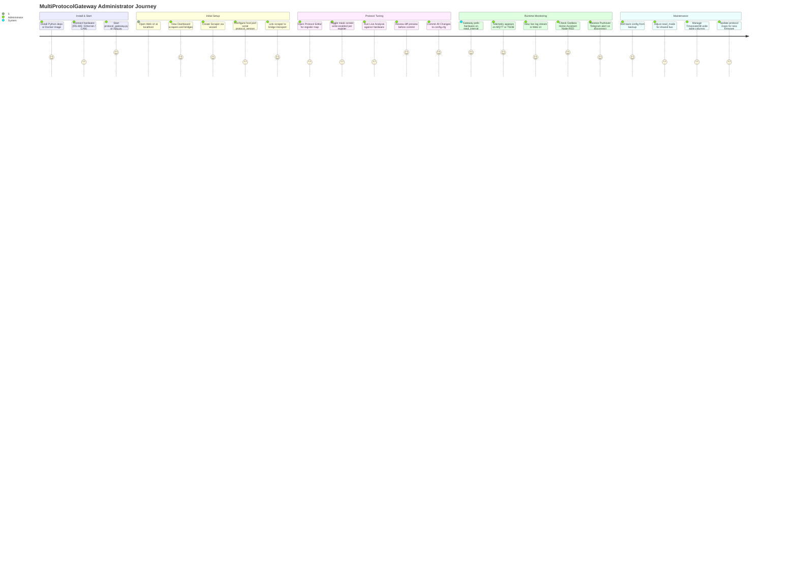
```mermaid
journey
    title MultiProtocolGateway Administrator Journey
    section Install & Start
      Install Python deps or Docker image: 4: Administrator
      Connect hardware (RS-485 / Ethernet / CAN): 3: Administrator
      Start protocol_gateway.py or mpg.py: 5: Administrator
    section Initial Setup
      Open Web UI at localhost:1717: 5: Administrator
      View Dashboard scrapers and bridges: 4: Administrator
      Create Scraper via wizard: 4: Administrator
      Configure host port serial protocol_version: 3: Administrator
      Link scraper to bridge transport: 4: Administrator
    section Protocol Tuning
      Open Protocol Editor for register map: 3: Administrator
      Toggle mask screen write-enabled per register: 3: Administrator
      Run Live Analysis against hardware: 3: Administrator
      Review diff preview before commit: 5: Administrator
      Commit All Changes to config.cfg: 5: Administrator
    section Runtime Monitoring
      Gateway polls hardware on read_interval: 5: System
      Telemetry appears on MQTT or TSDB: 5: Administrator
      View live log stream in Web UI: 4: Administrator
      Check Grafana Home Assistant Node-RED dashboards: 5: Administrator
      Receive Pushover Telegram alert on disconnect: 4: Administrator
    section Maintenance
      Roll back config from backup: 4: Administrator
      Adjust read_mode for shared bus: 3: Administrator
      Manage TimescaleDB wide table columns: 3: Administrator
      Update protocol maps for new firmware: 3: Administrator
```

---

## 6. State Diagram — Transport Connection Lifecycle

Applies to every `transport_base` subclass (scrapers like `modbus_rtu`/`modbus_tcp`/`canbus`/`serial_pylon` and bridges like `mqtt`). The `connected` property setter in `transport_base` is the single choke point: every subclass just assigns `self.connected = True/False` and the setter detects the transition, logs it, and fires Pushover/Telegram alerts — subclasses never alert directly.

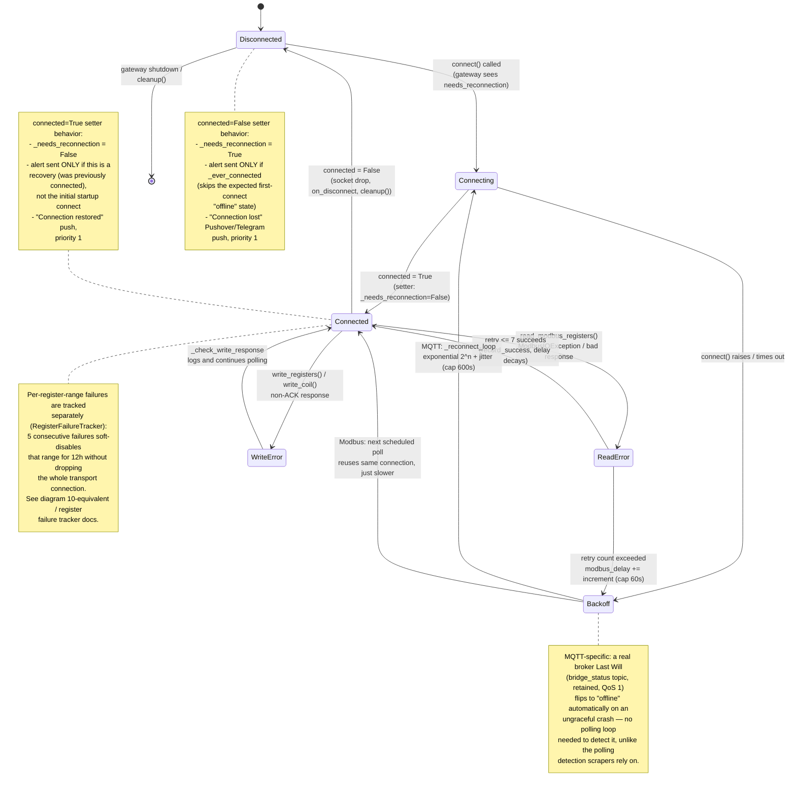
```mermaid
stateDiagram-v2
    [*] --> Disconnected

    Disconnected --> Connecting: connect() called<br/>(gateway sees needs_reconnection)

    Connecting --> Connected: connected = True<br/>(setter: _needs_reconnection=False)
    Connecting --> Backoff: connect() raises / times out

    Connected --> ReadError: read_modbus_registers()<br/>ModbusIOException / bad response
    Connected --> WriteError: write_registers() / write_coil()<br/>non-ACK response
    Connected --> Disconnected: connected = False<br/>(socket drop, on_disconnect, cleanup())

    ReadError --> Connected: retry <= 7 succeeds<br/>(record_success, delay decays)
    ReadError --> Backoff: retry count exceeded<br/>modbus_delay += increment (cap 60s)
    WriteError --> Connected: _check_write_response<br/>logs and continues polling

    Backoff --> Connecting: MQTT: _reconnect_loop<br/>exponential 2^n + jitter (cap 600s)
    Backoff --> Connected: Modbus: next scheduled poll<br/>reuses same connection, just slower

    note right of Connected
        Per-register-range failures are tracked
        separately (RegisterFailureTracker):
        5 consecutive failures soft-disables
        that range for 12h without dropping
        the whole transport connection.
        See diagram 10-equivalent / register
        failure tracker docs.
    end note

    note right of Disconnected
        connected=False setter behavior:
        - _needs_reconnection = True
        - alert sent ONLY if _ever_connected
          (skips the expected first-connect
          "offline" state)
        - "Connection lost" Pushover/Telegram
          push, priority 1
    end note

    note left of Connected
        connected=True setter behavior:
        - _needs_reconnection = False
        - alert sent ONLY if this is a
          recovery (was previously connected),
          not the initial startup connect
        - "Connection restored" push,
          priority 1
    end note

    note right of Backoff
        MQTT-specific: a real broker Last Will
        (bridge_status topic, retained, QoS 1)
        flips to "offline" automatically on an
        ungraceful crash — no polling loop
        needed to detect it, unlike the polling
        detection scrapers rely on.
    end note

    Disconnected --> [*]: gateway shutdown /<br/>cleanup()
```

---

## 7. State Diagram — Staging / Commit Workflow (Web UI)

The SQLite staging DB (`mpg_staging.db`) sits between the Web UI and `config.cfg`/protocol CSVs. Every `Setting`, `ProtocolRegister`, and `DeviceProtocolSelection` row carries its own `is_dirty` flag; a commit is only enabled when at least one of those flags (or a pending deletion, or a dirty `SettingDescription`) is set.

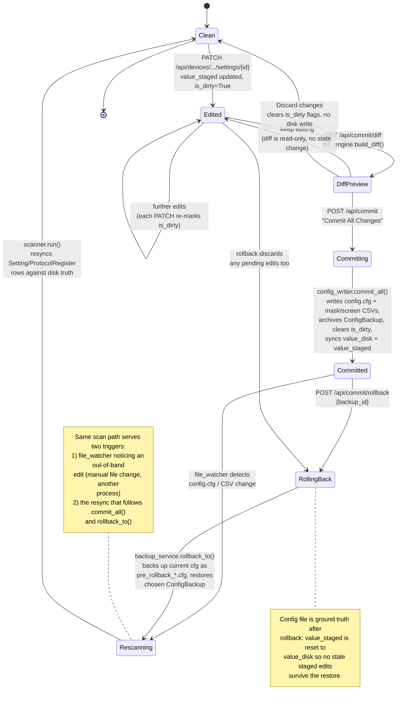
```mermaid
stateDiagram-v2
    [*] --> Clean

    Clean --> Edited: PATCH /api/devices/.../settings/{id}<br/>value_staged updated, is_dirty=True

    Edited --> Edited: further edits<br/>(each PATCH re-marks is_dirty)
    Edited --> DiffPreview: GET /api/commit/diff<br/>diff_engine.build_diff()
    DiffPreview --> Edited: keep editing<br/>(diff is read-only, no state change)
    DiffPreview --> Clean: Discard changes<br/>clears is_dirty flags, no disk write

    DiffPreview --> Committing: POST /api/commit<br/>"Commit All Changes"
    Committing --> Committed: config_writer.commit_all()<br/>writes config.cfg + mask/screen CSVs,<br/>archives ConfigBackup, clears is_dirty,<br/>syncs value_disk = value_staged

    Committed --> Rescanning: file_watcher detects<br/>config.cfg / CSV change
    Rescanning --> Clean: scanner.run()<br/>resyncs Setting/ProtocolRegister<br/>rows against disk truth

    Committed --> RollingBack: POST /api/commit/rollback<br/>{backup_id}
    Edited --> RollingBack: rollback discards<br/>any pending edits too
    RollingBack --> Rescanning: backup_service.rollback_to()<br/>backs up current cfg as<br/>pre_rollback_*.cfg, restores<br/>chosen ConfigBackup

    note right of RollingBack
        Config file is ground truth after
        rollback: value_staged is reset to
        value_disk so no stale staged edits
        survive the restore.
    end note

    note left of Rescanning
        Same scan path serves two triggers:
        1) file_watcher noticing an out-of-band
           edit (manual file change, another
           process)
        2) the resync that follows commit_all()
           and rollback_to()
    end note

    Clean --> [*]
```

---

## 8. Flowchart — Read Mode Decision Tree

`[general] read_mode` in `config.cfg` is `sequential` (default), `concurrent`, or `interleaved`. It is validated once at startup — an unrecognized value falls back to `sequential` with a warning. The right choice depends on whether transports share a physical bus.

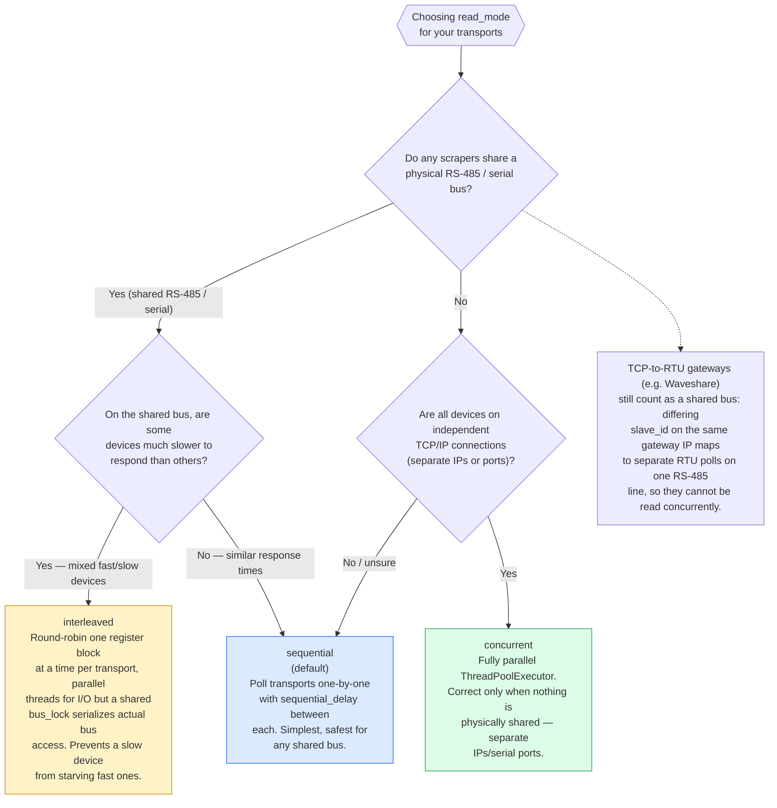
```mermaid
flowchart TD
    START{{"Choosing read_mode<br/>for your transports"}}
    Q1{"Do any scrapers share a<br/>physical RS-485 / serial bus?"}
    Q2{"Are all devices on independent<br/>TCP/IP connections<br/>(separate IPs or ports)?"}
    Q3{"On the shared bus, are some<br/>devices much slower to<br/>respond than others?"}

    SEQ["sequential<br/>(default)<br/>Poll transports one-by-one<br/>with sequential_delay between<br/>each. Simplest, safest for<br/>any shared bus."]
    CONC["concurrent<br/>Fully parallel ThreadPoolExecutor.<br/>Correct only when nothing is<br/>physically shared — separate<br/>IPs/serial ports."]
    INTER["interleaved<br/>Round-robin one register block<br/>at a time per transport, parallel<br/>threads for I/O but a shared<br/>bus_lock serializes actual bus<br/>access. Prevents a slow device<br/>from starving fast ones."]

    START --> Q1
    Q1 -- "Yes (shared RS-485 / serial)" --> Q3
    Q1 -- "No" --> Q2

    Q2 -- "Yes" --> CONC
    Q2 -- "No / unsure" --> SEQ

    Q3 -- "Yes — mixed fast/slow devices" --> INTER
    Q3 -- "No — similar response times" --> SEQ

    note1["TCP-to-RTU gateways (e.g. Waveshare)<br/>still count as a shared bus: differing<br/>slave_id on the same gateway IP maps<br/>to separate RTU polls on one RS-485<br/>line, so they cannot be read concurrently."]
    Q1 -.-> note1

    style SEQ fill:#dbeafe,stroke:#2563eb
    style CONC fill:#dcfce7,stroke:#16a34a
    style INTER fill:#fef3c7,stroke:#d97706
```

---

## 9. Sequence Diagram — MQTT Writeback

End-to-end path for a Home Assistant command entity writing a register back to hardware, e.g. a battery charge-current setpoint.

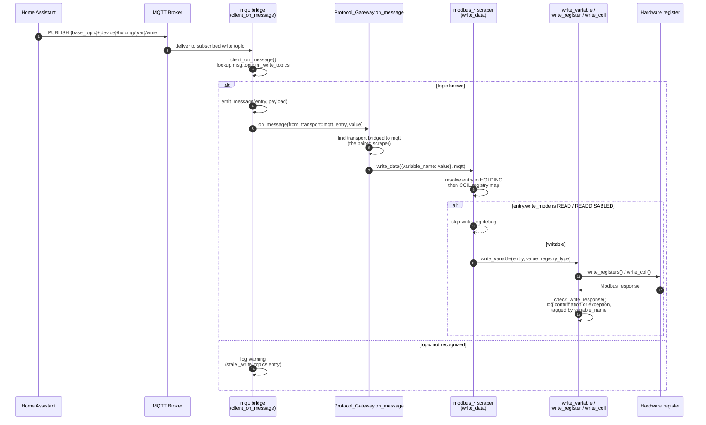
```mermaid
sequenceDiagram
    autonumber
    participant HA as Home Assistant
    participant Broker as MQTT Broker
    participant MQTT as mqtt bridge<br/>(client_on_message)
    participant GW as Protocol_Gateway.on_message
    participant Scraper as modbus_* scraper<br/>(write_data)
    participant Reg as write_variable /<br/>write_register / write_coil
    participant HW as Hardware register

    HA->>Broker: PUBLISH {base_topic}/{device}/holding/{var}/write
    Broker->>MQTT: deliver to subscribed write topic

    MQTT->>MQTT: client_on_message()<br/>lookup msg.topic in _write_topics
    alt topic known
        MQTT->>MQTT: _emit_message(entry, payload)
        MQTT->>GW: on_message(from_transport=mqtt, entry, value)
        GW->>GW: find transport bridged to mqtt<br/>(the paired scraper)
        GW->>Scraper: write_data({variable_name: value}, mqtt)

        Scraper->>Scraper: resolve entry in HOLDING<br/>then COIL registry map
        alt entry.write_mode is READ / READDISABLED
            Scraper--)Scraper: skip write, log debug
        else writable
            Scraper->>Reg: write_variable(entry, value, registry_type)
            Reg->>HW: write_registers() / write_coil()
            HW-->>Reg: Modbus response
            Reg->>Reg: _check_write_response()<br/>log confirmation or exception,<br/>tagged by variable_name
        end
    else topic not recognized
        MQTT->>MQTT: log warning<br/>(stale _write_topics entry)
    end
```

---

## 10. Flowchart — ScrapeGroup Consolidation

`ScrapeGroup` gives multiple logical transports pointed at the *same physical device* (`scrape_target`) a single shared read, instead of each one re-polling the hardware independently.

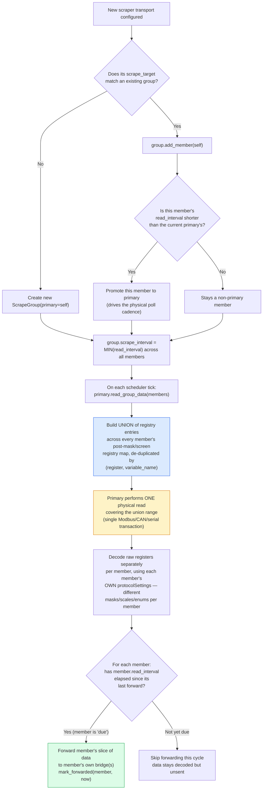
```mermaid
flowchart TD
    A["New scraper transport configured"] --> B{"Does its scrape_target<br/>match an existing group?"}
    B -- "No" --> C["Create new ScrapeGroup(primary=self)"]
    B -- "Yes" --> D["group.add_member(self)"]

    D --> E{"Is this member's<br/>read_interval shorter<br/>than the current primary's?"}
    E -- "Yes" --> F["Promote this member to primary<br/>(drives the physical poll cadence)"]
    E -- "No" --> G["Stays a non-primary member"]

    C & F & G --> H["group.scrape_interval =<br/>MIN(read_interval) across all members"]

    H --> I["On each scheduler tick:<br/>primary.read_group_data(members)"]
    I --> J["Build UNION of registry entries<br/>across every member's post-mask/screen<br/>registry map, de-duplicated by<br/>(register, variable_name)"]
    J --> K["Primary performs ONE physical read<br/>covering the union range<br/>(single Modbus/CAN/serial transaction)"]

    K --> L["Decode raw registers separately<br/>per member, using each member's<br/>OWN protocolSettings — different<br/>masks/scales/enums per member"]

    L --> M{"For each member:<br/>has member.read_interval<br/>elapsed since its<br/>last forward?"}
    M -- "Yes (member is 'due')" --> N["Forward member's slice of data<br/>to member's own bridge(s)<br/>mark_forwarded(member, now)"]
    M -- "Not yet due" --> O["Skip forwarding this cycle<br/>data stays decoded but unsent"]

    style K fill:#fef3c7,stroke:#d97706
    style J fill:#dbeafe,stroke:#2563eb
    style N fill:#dcfce7,stroke:#16a34a
```

---

## 11. Flowchart — TimescaleDB Write Routing

The `timescaledb` bridge always writes the schema-flexible narrow table, and additionally upserts a per-protocol wide table when one exists. Failures during an outage fall back to a persistent disk backlog rather than dropping data.

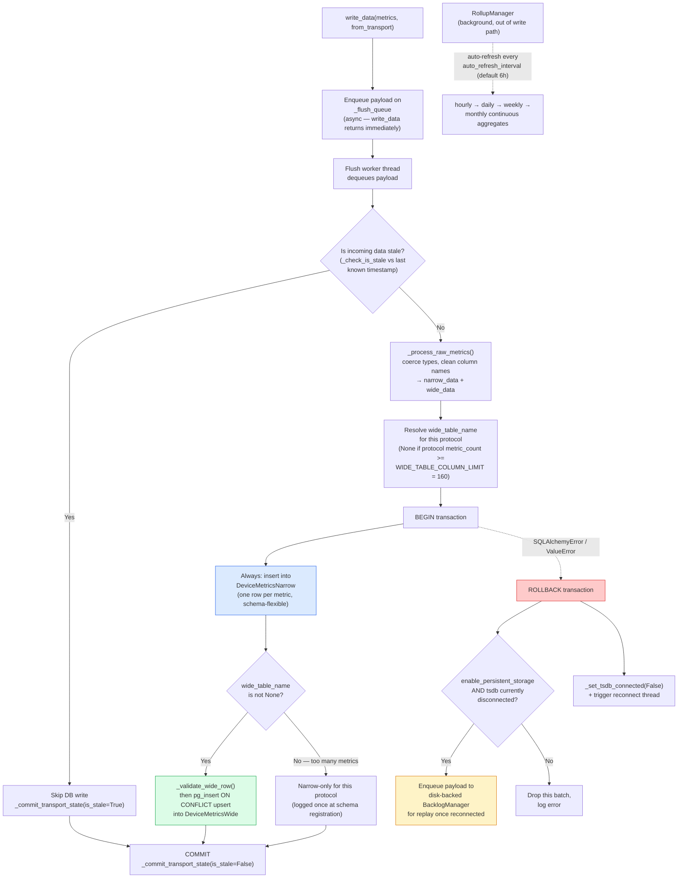
```mermaid
flowchart TD
    A["write_data(metrics, from_transport)"] --> B["Enqueue payload on<br/>_flush_queue<br/>(async — write_data returns immediately)"]
    B --> C["Flush worker thread<br/>dequeues payload"]

    C --> D{"Is incoming data stale?<br/>(_check_is_stale vs last<br/>known timestamp)"}
    D -- "Yes" --> D1["Skip DB write<br/>_commit_transport_state(is_stale=True)"]
    D -- "No" --> E["_process_raw_metrics()<br/>coerce types, clean column names<br/>→ narrow_data + wide_data"]

    E --> F["Resolve wide_table_name<br/>for this protocol<br/>(None if protocol metric_count >=<br/>WIDE_TABLE_COLUMN_LIMIT = 160)"]

    F --> G["BEGIN transaction"]
    G --> H["Always: insert into<br/>DeviceMetricsNarrow<br/>(one row per metric, schema-flexible)"]
    H --> I{"wide_table_name<br/>is not None?"}
    I -- "Yes" --> J["_validate_wide_row()<br/>then pg_insert ON CONFLICT upsert<br/>into DeviceMetricsWide"]
    I -- "No — too many metrics" --> K["Narrow-only for this protocol<br/>(logged once at schema registration)"]

    J & K & D1 --> L["COMMIT<br/>_commit_transport_state(is_stale=False)"]

    G -.->|"SQLAlchemyError / ValueError"| M["ROLLBACK transaction"]
    M --> N{"enable_persistent_storage<br/>AND tsdb currently<br/>disconnected?"}
    N -- "Yes" --> O["Enqueue payload to<br/>disk-backed BacklogManager<br/>for replay once reconnected"]
    N -- "No" --> P["Drop this batch,<br/>log error"]
    M --> Q["_set_tsdb_connected(False)<br/>+ trigger reconnect thread"]

    R["RollupManager<br/>(background, out of write path)"] -.->|"auto-refresh every<br/>auto_refresh_interval (default 6h)"| S["hourly → daily → weekly →<br/>monthly continuous aggregates"]

    style H fill:#dbeafe,stroke:#2563eb
    style J fill:#dcfce7,stroke:#16a34a
    style O fill:#fef3c7,stroke:#d97706
    style M fill:#fecaca,stroke:#dc2626
```

---

## 12. Flowchart — Live Protocol Analysis Workflow

The "Analyze" page lets an operator scan a live Modbus device and compare it against one or more candidate protocol maps, scoring each register and suggesting adds/removes before writing anything to disk. It only works against a `modbus_base`-derived scraper — the page is unavailable for CAN/serial transports.

This does support building a map from a JSON-only stub protocol (a manufacturer folder with only the `.json` descriptor and no registry-map CSVs yet), including the case where the device itself was just created and its own `send_holding_register`/`send_input_register`/etc settings are only a guess. `analyze_protocols()` no longer gates on the transport's currently-active protocol map or on those send_* flags at all — instead, `_probe_registry_type()` cheaply samples 8 addresses spread across the full space (`0, 100, 500, 1000, 3000, 9000, 30000, 60000`, not consecutive from zero — real protocols frequently start well above register 0, e.g. `victron_smartsolar_mppt` starts at 771) to determine, from the hardware's actual responses, which of the four registry types are worth a full dense sweep. A Modbus `ILLEGAL_FUNCTION` exception settles a type as unsupported after just one probe; anything else (wrong address, timeout) keeps sampling the remaining offsets before giving up. Types the probe can't confirm are reported to the operator as `skipped_types`, each with a reason, and a **Scan Checked Anyway** control lets them force a full sweep of any skipped type regardless of what the probe found — the probe is a heuristic, not a certainty.

```mermaid
flowchart TD
    A["Admin opens Analyze page<br/>for a device"] --> B["Selects candidate protocol(s)<br/>+ current_protocol + batch_size"]
    B --> C["Browser opens EventSource<br/>GET /api/analyze/{device}/progress<br/>(SSE connection, opened FIRST)"]
    C --> D["Browser fetch()<br/>POST /api/analyze/{device}<br/>{protocol_names, current_protocol,<br/>batch_size, force_types}"]

    D --> E["Router registers a progress_queue<br/>keyed by device name<br/>BEFORE starting the scan"]
    E --> F["asyncio.to_thread(<br/>transport.analyze_protocols)<br/>— blocking Modbus I/O off the event loop"]

    F --> G["For each of the 4 registry types<br/>(INPUT/HOLDING/COIL/DISCRETE):<br/>in force_types? → skip probe,<br/>treat as alive ('Scan Anyway')"]
    G --> H["_probe_registry_type():<br/>sample up to 8 addresses spread across<br/>the full space (0, 100, 500, 1000,<br/>3000, 9000, 30000, 60000) — NOT<br/>consecutive from 0, so a sparse base<br/>register (e.g. 771) is still found"]

    H --> H1{"Real data at<br/>this offset?"}
    H1 -- "Yes" --> H2["Type is alive — stop probing,<br/>move to full dense sweep"]
    H1 -- "No" --> H3{"Response is a Modbus<br/>exception?"}
    H3 -- "ILLEGAL_FUNCTION" --> H4["Definitive — device doesn't<br/>implement this function code<br/>at all. Stop after 1 probe."]
    H3 -- "ILLEGAL_ADDRESS / other /<br/>timeout / no response" --> H5["Inconclusive for THIS address only<br/>— try the next spread offset"]
    H5 -.->|"offsets remain"| H
    H5 -->|"all 8 offsets tried,<br/>none succeeded"| H6["Type skipped — reason recorded<br/>in skipped_types (surfaced to<br/>the operator, not silent)"]

    H2 --> I["progress_cb('probe', n, 4)<br/>then, per alive type,<br/>progress_cb(phase, done, total)<br/>during the dense sweep"]
    H4 --> I
    H6 --> I
    I --> J["Pushed onto progress_queue"]
    J --> K["SSE endpoint polls the queue<br/>and relays each event to the<br/>browser as it arrives"]
    K --> L["Progress bar updates live —<br/>'Probing device…' first, then<br/>'Scanning Input/Holding/…' per type"]
    J -.->|"loop continues until scan done"| I

    H2 --> M["capture_analysis_scan()<br/>dense sweep of the FULL 0–65535<br/>address space for this type only —<br/>NOT limited to already-known<br/>register addresses"]
    M --> N["For each CANDIDATE protocol<br/>selected by the admin<br/>(can include a brand-new JSON<br/>stub protocol with zero CSV rows)"]
    N --> O["Score every entry the candidate<br/>already declares:<br/>1.0 present + in documented range<br/>0.5 present but out of range<br/>0.0 absent from live scan<br/>(a stub scores 0/0 — nothing to score yet)"]
    O --> P["unknown_in_scan = every raw register<br/>found on the wire NOT already in this<br/>candidate's map → 'addable' suggestion<br/>(placeholder name register_N).<br/>For a stub, this is EVERY register found —<br/>this is how a map gets built from scratch."]

    P --> Q["_SCAN_DONE sentinel queued<br/>→ SSE stream sends 'done'<br/>→ progress_queue unregistered"]
    Q --> R["POST response: ProtocolAnalysisReport<br/>(scores + actions per protocol,<br/>plus skipped_types with reasons)"]
    R --> S["Browser renders per-protocol<br/>score + checkable add/remove rows"]

    S --> T{"skipped_types<br/>non-empty?"}
    T -- "Yes" --> T1["Warning banner lists each skipped<br/>type + reason, with a checkbox<br/>and 'Scan Checked Anyway' button"]
    T1 -.->|"operator checks a type,<br/>clicks Scan Anyway"| D
    T -- "No" --> U0["No warning shown"]

    T1 --> U["Admin reviews results,<br/>checks add/remove rows,<br/>clicks Commit"]
    U0 --> U
    U --> V["POST /api/analyze/{device}/commit<br/>{changes: [...]}"]
    V --> W["Group changes by<br/>(protocol_name, registry_type)"]
    W --> X{"Registry CSV exists<br/>for this protocol/type?"}
    X -- "No, but action is 'add'<br/>(the stub-protocol case)" --> X1["_create_protocol_csv()<br/>writes a new, header-only<br/>protocol.registry_type_registry_map.csv<br/>into the SAME protocols/ folder as<br/>the stub's JSON descriptor"]
    X -- "No, only removals" --> X2["Nothing to do — skip,<br/>log and continue"]
    X -- "Yes" --> Y["_apply_protocol_changes()<br/>add / update / remove rows in-place"]
    X1 --> Y

    Y --> Z{"Any file<br/>actually changed?"}
    Z -- "Yes" --> AA["scanner.run()<br/>resyncs staging DB against<br/>the newly written CSVs"]
    Z -- "No" --> AB["Log warning —<br/>rows may already have<br/>matched, nothing written"]

    AA --> AC["Response: files_written,<br/>changes_applied, touched_files"]
    AB --> AC

    AC --> AD["Result: the stub protocol now<br/>has real CSV map(s) alongside its<br/>JSON descriptor — indistinguishable<br/>from a hand-written or shipped protocol"]

    style F fill:#fef3c7,stroke:#d97706
    style H4 fill:#dcfce7,stroke:#16a34a
    style H6 fill:#fecaca,stroke:#dc2626
    style K fill:#dbeafe,stroke:#2563eb
    style T1 fill:#fef3c7,stroke:#d97706
    style Y fill:#dcfce7,stroke:#16a34a
    style X1 fill:#fef3c7,stroke:#d97706
```

---

## 13. Flowchart — Web UI Component Architecture

The FastAPI app in `classes/WebServer` is organized into routers (HTTP boundary), services (business logic), and a small set of engines that own the config-file/staging-DB relationship. Most routers serve a mix of JSON (for `fetch()`/SSE calls) and HTML fragments (for HTMX swaps) from the same `/api/*` endpoints — there isn't a hard separation between "page" and "API" routes.

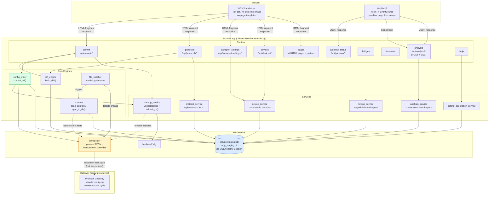
```mermaid
flowchart TB
    subgraph Browser["Browser"]
        HTMX["HTMX attributes<br/>(hx-get / hx-post / hx-swap)<br/>on page templates"]
        JS["Vanilla JS<br/>fetch() + EventSource<br/>(analyze page, live status)"]
    end

    subgraph App["FastAPI app (classes/WebServer/main.py)"]
        direction TB

        subgraph Routers["Routers"]
            PAGES["pages<br/>full HTML pages + partials"]
            DEV["devices<br/>/api/devices/*"]
            TS["transport_settings<br/>/api/transport-settings/*"]
            PROTO["protocols<br/>/api/protocols/*"]
            COMMIT["commit<br/>/api/commit/*"]
            ANALYZE["analysis<br/>/api/analyze/*<br/>(POST + SSE)"]
            BRIDGES["bridges"]
            TSDB_R["timescale"]
            GWSTAT["gateway_status<br/>/api/gateway/*"]
            HELP["help"]
        end

        subgraph Services["Services"]
            DEVSVC["device_service<br/>dashboard / nav data"]
            PROTOSVC["protocol_service<br/>register map CRUD"]
            ANALYSVC["analysis_service<br/>connection status helpers"]
            BRIDGESVC["bridge_service<br/>staged-deletion helpers"]
            BACKUPSVC["backup_service<br/>ConfigBackup + rollback_to()"]
            DESCSVC["setting_description_service"]
        end

        subgraph Engines["Core Engines"]
            SCANNER["scanner<br/>scan_config() / sync_to_db()"]
            DIFF["diff_engine<br/>build_diff()"]
            WRITER["config_writer<br/>commit_all()"]
            WATCHER["file_watcher<br/>watchdog observer"]
        end
    end

    subgraph Storage["Persistence"]
        DB[("SQLite staging DB<br/>mpg_staging.db<br/>via SQLAlchemy Session")]
        DISK["config.cfg +<br/>protocol CSVs +<br/>mask/screen overrides"]
        BACKUPS["backups/*.cfg"]
    end

    subgraph GWProc["Gateway (separate runtime)"]
        GW["Protocol_Gateway<br/>reloads config.cfg<br/>on next scrape cycle"]
    end

    HTMX -->|"HTML fragment<br/>response"| PAGES & DEV & TS & PROTO & COMMIT
    JS -->|"JSON response"| ANALYZE
    JS -->|"SSE stream"| ANALYZE
    JS -->|"JSON response"| GWSTAT

    DEV --> DEVSVC
    TS --> DEVSVC
    PROTO --> PROTOSVC
    ANALYZE --> ANALYSVC
    BRIDGES --> BRIDGESVC
    COMMIT --> BACKUPSVC
    COMMIT --> WRITER
    COMMIT --> DIFF
    PROTO --> DIFF
    HELP --> DESCSVC

    DEVSVC & PROTOSVC & ANALYSVC & BRIDGESVC & DESCSVC --> DB
    DIFF --> DB
    WRITER --> DB
    WRITER --> DISK
    WRITER --> BACKUPSVC
    BACKUPSVC --> BACKUPS
    BACKUPSVC -.->|"rollback restores"| DISK

    WATCHER -->|"detects change"| DISK
    WATCHER -->|"triggers"| SCANNER
    SCANNER --> DB
    SCANNER -.->|"reads current state"| DISK

    DISK -.->|"reload on next cycle<br/>(not live-pushed)"| GW

    style DB fill:#dbeafe,stroke:#2563eb
    style DISK fill:#fef3c7,stroke:#d97706
    style WRITER fill:#dcfce7,stroke:#16a34a
```

---

## 14. Deployment / Container Diagram — Docker Stack

The reference stack in `documentation/docker/docker-compose.yml`. All containers share a single bridge network (`mpg_internal`, `10.17.0.0/24`); every service is optional except `mpg` itself — bridges are only needed if the matching MPG bridge transport is configured.

```mermaid
flowchart TB
    subgraph Host["Host machine"]
        subgraph Net["docker network: mpg_internal (bridge, 10.17.0.0/24)"]
            MPG["mpg<br/>buxtoncalvin/multiprotocolgateway<br/>:1717 → Web UI"]
            TSDB["timescaledb<br/>timescale/timescaledb-ha:pg18<br/>:5432"]
            INFLUX1["influxdb<br/>influxdb:1.8.0<br/>:8086"]
            INFLUX3["influxdb3<br/>influxdb:3-core<br/>:8100→8181"]
            INFLUX3UI["influxdb3-explorer<br/>:8889 / :8887 / :8886"]
            MOSQ["mosquitto<br/>eclipse-mosquitto:2<br/>:1883 (MQTT) / :9001 (WS)"]
            PGADMIN["pgadmin<br/>dpage/pgadmin4<br/>:5050"]
            CHRONO["chronograf<br/>:8888"]
            GRAF["grafana<br/>grafana/grafana<br/>:3000"]
            PROM["prometheus<br/>prom/prometheus<br/>:9090"]
            PORTAINER["portainer<br/>portainer-ce<br/>:9000"]
        end

        subgraph Volumes["Named / host volumes"]
            V_MPG[("mpg_config, mpg_protocols<br/>(+ optional backlogs, logs)")]
            V_TSDB[("timescaledb_data")]
            V_INF1[("influxdb_data, influxdb_config")]
            V_INF3[("influxdb3 data, plugins")]
            V_MOSQ[("mosquitto config/data/log")]
            V_PGA[("pgadmin_data")]
            V_CHR[("chronograf_data")]
            V_GRAF[("grafana_data, provisioning")]
            V_PROM[("prometheus_data + prometheus.yml")]
            V_PORT[("portainer_data")]
        end

        HW["/dev/ttyUSB0, /dev/ttyACM0<br/>(RS-485 USB / serial passthrough,<br/>only if Modbus RTU over serial)"]
        DOCKSOCK["/var/run/docker.sock<br/>(prometheus + portainer)"]
    end

    subgraph Client["Operator's browser / network"]
        ADMIN["Administrator"]
        HA["Home Assistant / Node-RED"]
    end

    ADMIN -->|":1717"| MPG
    ADMIN -->|":5050"| PGADMIN
    ADMIN -->|":8888"| CHRONO
    ADMIN -->|":3000"| GRAF
    ADMIN -->|":9090"| PROM
    ADMIN -->|":9000"| PORTAINER
    ADMIN -->|":8889"| INFLUX3UI

    HW -.->|"device passthrough"| MPG

    MPG -->|"writes rows"| TSDB
    MPG -->|"line protocol"| INFLUX1
    MPG -->|"v3 API, apiv3_ token"| INFLUX3
    MPG -->|"publish/subscribe :1883"| MOSQ
    MPG -->|"pull :1717/metrics"| PROM
    MOSQ <-->|"MQTT :1883 / :9001"| HA

    PGADMIN --> TSDB
    CHRONO --> INFLUX1
    INFLUX3UI --> INFLUX3
    GRAF --> TSDB
    GRAF --> INFLUX1
    PROM -.->|"container discovery"| DOCKSOCK
    PORTAINER -.->|"container management"| DOCKSOCK

    MPG --- V_MPG
    TSDB --- V_TSDB
    INFLUX1 --- V_INF1
    INFLUX3 --- V_INF3
    MOSQ --- V_MOSQ
    PGADMIN --- V_PGA
    CHRONO --- V_CHR
    GRAF --- V_GRAF
    PROM --- V_PROM
    PORTAINER --- V_PORT

    style MPG fill:#dbeafe,stroke:#2563eb
    style TSDB fill:#dcfce7,stroke:#16a34a
    style MOSQ fill:#fef3c7,stroke:#d97706
```

---

## 15. State Diagram — Register Failure Tracker

Tracked per `(register_range, registry_type)` pair on a `modbus_base`-derived scraper — distinct from, and finer-grained than, the whole-transport connection lifecycle in diagram 6. A single bad register block on an otherwise healthy device gets soft-disabled without dropping the connection.

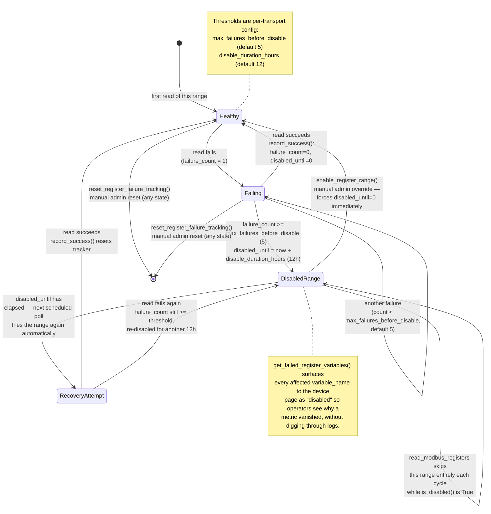
```mermaid
stateDiagram-v2
    [*] --> Healthy: first read of this range

    Healthy --> Failing: read fails<br/>(failure_count = 1)
    Failing --> Failing: another failure<br/>(count < max_failures_before_disable,<br/>default 5)
    Failing --> Healthy: read succeeds<br/>record_success():<br/>failure_count=0, disabled_until=0

    Failing --> DisabledRange: failure_count >=<br/>max_failures_before_disable (5)<br/>disabled_until = now + disable_duration_hours (12h)

    DisabledRange --> DisabledRange: read_modbus_registers skips<br/>this range entirely each cycle<br/>while is_disabled() is True

    DisabledRange --> RecoveryAttempt: disabled_until has<br/>elapsed — next scheduled poll<br/>tries the range again automatically

    RecoveryAttempt --> Healthy: read succeeds<br/>record_success() resets tracker
    RecoveryAttempt --> DisabledRange: read fails again<br/>failure_count still >= threshold,<br/>re-disabled for another 12h

    Healthy --> [*]: reset_register_failure_tracking()<br/>manual admin reset (any state)
    Failing --> [*]: reset_register_failure_tracking()<br/>manual admin reset (any state)
    DisabledRange --> Healthy: enable_register_range()<br/>manual admin override —<br/>forces disabled_until=0 immediately

    note right of DisabledRange
        get_failed_register_variables() surfaces
        every affected variable_name to the device
        page as "disabled" so operators see why a
        metric vanished, without digging through logs.
    end note

    note left of Healthy
        Thresholds are per-transport config:
        max_failures_before_disable (default 5)
        disable_duration_hours (default 12)
    end note
```

---

## 16. Mindmap — Protocol Map Directory Structure

How `protocols/` is organized on disk, and where per-device customization lives instead (it is never written back into the shared protocol files).

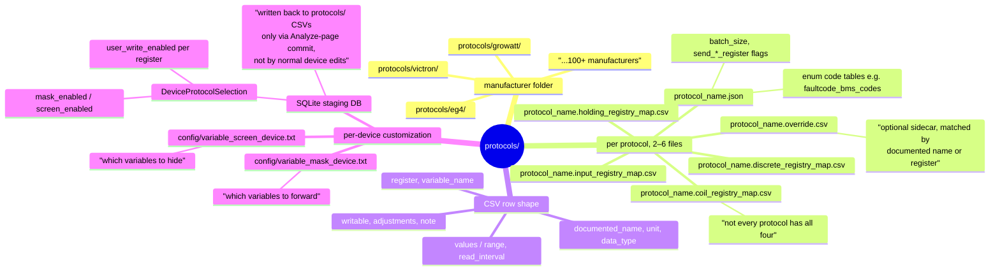
```mermaid
mindmap
  root((protocols/))
    manufacturer folder
      protocols/eg4/
      protocols/growatt/
      protocols/victron/
      "...100+ manufacturers"
    per protocol, 2–6 files
      protocol_name.json
        batch_size, send_*_register flags
        enum code tables e.g. faultcode_bms_codes
      protocol_name.holding_registry_map.csv
      protocol_name.input_registry_map.csv
      protocol_name.coil_registry_map.csv
        "not every protocol has all four"
      protocol_name.discrete_registry_map.csv
      protocol_name.override.csv
        "optional sidecar, matched by<br/>documented name or register"
    CSV row shape
      register, variable_name
      documented_name, unit, data_type
      values / range, read_interval
      writable, adjustments, note
    per-device customization
      config/variable_mask_device.txt
        "which variables to forward"
      config/variable_screen_device.txt
        "which variables to hide"
      SQLite staging DB
        DeviceProtocolSelection
          user_write_enabled per register
          mask_enabled / screen_enabled
        "written back to protocols/ CSVs<br/>only via Analyze-page commit,<br/>not by normal device edits"
```

---

## 17. Flowchart — Device Creation Wizard

The Web UI's "Create Scraper" page is a linear, gated wizard (each step unlocks the next). Notably, saving a new device writes **directly to `config.cfg`** — it does not go through the normal `Setting.is_dirty` staging flow used for editing existing devices (see diagram 7).

```mermaid
flowchart TD
    A(["Admin opens Create Scraper page"]) --> B["Step 1: Enter device name<br/>validated: letters/digits/underscore only"]
    B --> C{"Name valid &<br/>section doesn't<br/>already exist?"}
    C -- "No" --> B
    C -- "Yes" --> D["Step 2: Choose scraper transport type<br/>(modbus_rtu, modbus_tcp, canbus, ...)<br/>from the transport library"]

    D --> E["Step 3: Choose bridge(s)<br/>multi-select, 'None' allowed<br/>(mqtt, timescaledb, influxdb_out, ...)"]
    E --> F["Step 4: Choose protocol_version<br/>(e.g. eg4_18kpv, growatt_v0.14)"]
    F --> G["Step 5: Choose log_level"]

    G --> H["Settings editor renders:<br/>scraper's default keys<br/>(host/port/serial/slave_id/etc.),<br/>excluding fixed keys<br/>(transport, bridge, protocol_version, log_level)"]
    H --> I["Admin fills values,<br/>toggles which settings are active"]

    I --> J["Client-side validation:<br/>device_* keys required if active,<br/>true/false fields must be boolean"]
    J -- "invalid" --> H
    J -- "valid" --> K["Save → POST /api/devices/create<br/>{device_name, scraper_transport, bridge,<br/>protocol_version, log_level, settings[]}"]

    K --> L{"Server re-validates:<br/>section unused,<br/>scraper + bridge(s)<br/>exist in transport library"}
    L -- "No" --> M["409 / 400 error<br/>returned to wizard"]
    L -- "Yes" --> N["create_backup(config.cfg)<br/>archived as ConfigBackup"]

    N --> O["Append new [transport.device_name]<br/>section directly to config.cfg<br/>— bypasses the staging is_dirty flow"]
    O --> P["scanner.set_cfg_is_truth(True)<br/>scanner.run(db)<br/>syncs staging DB rows to match<br/>the file that was just written"]

    P --> Q["Response: status=created,<br/>section, keys_added"]
    Q --> R(["Wizard resets —<br/>device now live for the<br/>gateway's next reload cycle"])

    R -.->|"optional next step"| S["Admin can now run<br/>Live Analysis against the<br/>new device (see diagram 12)"]

    style K fill:#dbeafe,stroke:#2563eb
    style O fill:#fef3c7,stroke:#d97706
    style N fill:#dcfce7,stroke:#16a34a
```

---

## Related Documentation

- [README](../../README.md) — project overview and quick start
- [Analyze Guide](../usage/Analyze.md) — beginner-friendly walkthrough of Create Protocol, Create Scraper, and Analyze
- [Transports](../usage/transports.md) — scraper and bridge configuration
- [Protocols](../usage/protocols.md) — register map editing
- [TimescaleDB Bridge](../bridges/TimeScaleDB/timescaledb.md) — telemetry schema and queries
- [MQTT Bridge](../bridges/MQTT/MQTT_bridge.md) — publish topics and writeback
